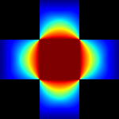
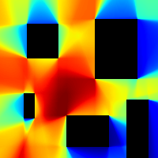
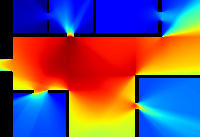
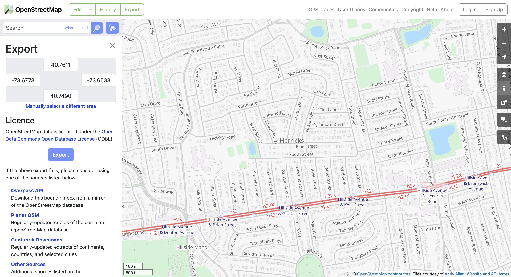
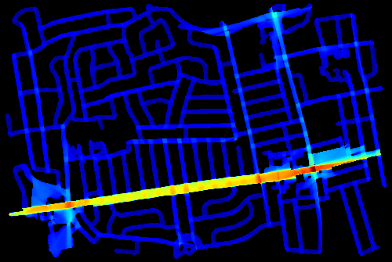

# Visiblity Graph Analysis Overview

This code performs a simple [visiblity graph analysis](https://en.wikipedia.org/wiki/Visibility_graph_analysis). The further to the right on the colormap below, the more visible.

## Examples

### t intersection
- **Input:** `test_imgs/t_in.png`
- **Output:** `test_imgs/t_out.png`

| Input Image | Output Image |
|-------------|--------------|
|  |  |

### Squares
- **Input:** `test_imgs/squares_in.png`
- **Output:** `test_imgs/squares_out.png`

| Input Image | Output Image |
|-------------|--------------|
|  |  |

### Floor Plan
- **Input:** `test_imgs/floorplan_in.png`
- **Output:** `test_imgs/floorplan_out.png`

| Input Image | Output Image |
|-------------|--------------|
|  |  |

### Streets (using coordinates)
- Coordinate Input: 40.7611, -73.6533 | 40.7490, -73.6773 | (shown in `test_imgs/streets_in.png`)
- **Output:** `test_imgs/streets_out.png`

| Input Image | Output Image |
|-------------|--------------|
|  |  |

## Usage

To use the code, simply run `run.py`. 
I recommend [Open Street Map](https://www.openstreetmap.org/export) for finding coordinates, but you can use whatever you prefer.
