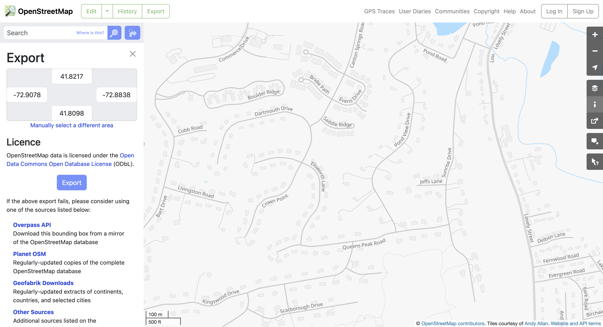

# Code Functionality Demonstration

This repository showcases the functionality of a program that processes different types of input images and generates corresponding output images. The images demonstrate various transformations and computations performed by the code.

## Table of Contents
- [Overview](#overview)
- [File Descriptions](#file-descriptions)
- [Usage](#usage)
- [Examples](#examples)
- [License](#license)

## Overview

The code processes input images and generates output images that highlight specific transformations or computations. The pairs of images below demonstrate the before and after states.

## File Descriptions

### T
- **Input:** `test_imgs/t.png`
- **Output:** `test_imgs/t.png`

| Input Image | Output Image |
|-------------|--------------|
|  |  |

### Squares
- **Input:** `test_imgs/squares_in.png`
- **Output:** `test_imgs/squares_out.png`

| Input Image | Output Image |
|-------------|--------------|
|  |  |

### Floor Plan
- **Input:** `test_imgs/floorplan_in.png`
- **Output:** `test_imgs/floorplan_out.png`

| Input Image | Output Image |
|-------------|--------------|
|  |  |

### Map
- **Input:** `test_imgs/map_in.png`
- **Output:** `test_imgs/map_out.png`

| Input Image | Output Image |
|-------------|--------------|
|  |  |

## Usage

To use the code, simply run run.py
